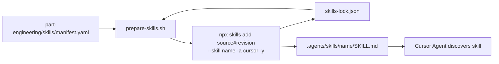

# Community Skills CLI + Cursor Pinning — Research

**Question:** What are the primary-source facts for preparing Community Skills from a manifest for Cursor?

**Scope:** Primary sources only — [skills.sh](https://skills.sh/), [vercel-labs/skills](https://github.com/vercel-labs/skills) README/CLI source, [Cursor Agent Skills docs](https://cursor.com/docs/context/skills). Empirical CLI checks used `skills@1.5.25` (`npx skills --version`) to confirm behavior not yet documented in README.

**Kit context:** The Starter Kit defines `part-engineering/skills/manifest.yaml` (source + revision + role) and `part-engineering/skills/prepare-skills.sh` so agents prepare pinned Community Skills locally without vendoring skill trees into the product repo ([starter-kit spec §21](../../ai-agent-starter-kit-spec.md)).

---

## Summary

| Topic | Primary-source fact |
| --- | --- |
| **Install entrypoint** | `npx skills add <source>` ([skills.sh/docs](https://skills.sh/docs), [vercel-labs/skills README](https://github.com/vercel-labs/skills/blob/main/README.md)) |
| **Cursor targeting** | `-a cursor` / `--agent cursor` ([README Supported Agents table](https://github.com/vercel-labs/skills/blob/main/README.md#supported-agents), [`src/agents.ts`](https://github.com/vercel-labs/skills/blob/main/src/agents.ts)) |
| **Project vs global** | Default = project; `-g` / `--global` = user-level ([README Installation Scope](https://github.com/vercel-labs/skills/blob/main/README.md#installation-scope)) |
| **Revision pin (shipped)** | Git ref via URL fragment: `owner/repo#<tag\|branch\|sha>` ([`src/source-parser.ts`](https://github.com/vercel-labs/skills/blob/main/src/source-parser.ts), [PR #814](https://github.com/vercel-labs/skills/pull/814)) |
| **Lock / provenance** | Project writes `skills-lock.json` at repo root ([`src/local-lock.ts`](https://github.com/vercel-labs/skills/blob/main/src/local-lock.ts)); `ref` present when pinned |
| **Cursor load paths** | `.agents/skills/`, `.cursor/skills/`, `~/.agents/skills/`, `~/.cursor/skills/` ([Cursor docs](https://cursor.com/docs/context/skills#skill-directories)) |
| **CLI project path for Cursor** | `.agents/skills/` (canonical project target) ([README](https://github.com/vercel-labs/skills/blob/main/README.md#supported-agents), [`src/agents.ts`](https://github.com/vercel-labs/skills/blob/main/src/agents.ts)) |
| **Restore from lock** | `npx skills experimental_install` (experimental; reads `skills-lock.json`) ([`src/cli.ts`](https://github.com/vercel-labs/skills/blob/main/src/cli.ts), [`src/install.ts`](https://github.com/vercel-labs/skills/blob/main/src/install.ts)) |

**Bottom line for the kit:** `prepare-skills.sh` can reliably translate `manifest.yaml` pins into non-interactive `npx skills add …#<revision> --skill <name> -a cursor -y` invocations and optionally reconcile/commit `skills-lock.json`. Humans still own manifest curation, pin selection, auth for private sources, security review, and deliberate upgrade policy (avoid `skills update` for pinned critical methods).

---

## Findings (with citations)

### 1. skills.sh — discovery index, not a package registry

[skills.sh](https://skills.sh/) is the public skills leaderboard/directory. Its [docs](https://skills.sh/docs) state:

- Install via the open-source `skills` CLI: `npx skills add vercel-labs/agent-skills`.
- The site links to the CLI repo: [github.com/vercel-labs/skills](https://github.com/vercel-labs/skills).
- Per-skill pages show a concrete install line. Example [wayfinder](https://skills.sh/mattpocock/skills/wayfinder):  
  `npx skills add https://github.com/mattpocock/skills --skill wayfinder`.

**Not documented on skills.sh:** revision pinning, `--agent cursor`, project vs global scope, or lock-file workflow. Discovery starts at skills.sh; pinning and Cursor targeting come from the CLI repo/source.

[Packs](https://skills.sh/docs/packs) are a separate unlisted bundle format (`npx skills add https://skills.sh/p/<pack-id>`). Pack docs say new installs fetch current contents and `skills update` pulls changes — oriented toward “latest,” not kit-style pins.

---

### 2. vercel-labs/skills CLI — commands and flags

**Package / invocation**

```bash
npx skills add <source> [options]
npx skills list | ls
npx skills remove | rm
npx skills update | upgrade
npx skills find [query]
npx skills init [name]
npx skills use <package>@<skill>   # prompt-only, no install
npx skills experimental_install    # restore from skills-lock.json
npx skills experimental_sync       # sync from node_modules
```

Sources: [README Other Commands](https://github.com/vercel-labs/skills/blob/main/README.md#other-commands), [`src/cli.ts` help text](https://github.com/vercel-labs/skills/blob/main/src/cli.ts) (verified locally with `npx skills --help`, CLI version **1.5.25**).

**`skills add` options relevant to the kit**

| Flag | Meaning | Source |
| --- | --- | --- |
| *(none)* | Project scope (default) | [README Installation Scope](https://github.com/vercel-labs/skills/blob/main/README.md#installation-scope) |
| `-g`, `--global` | User-level install | Same |
| `-a`, `--agent <agents…>` | Target agent(s); `cursor` for Cursor | [README Options](https://github.com/vercel-labs/skills/blob/main/README.md#options), [Supported Agents](https://github.com/vercel-labs/skills/blob/main/README.md#supported-agents) |
| `-s`, `--skill <skills…>` | Install named skills from repo; `'*'` = all | Same |
| `-y`, `--yes` | Non-interactive / CI-friendly | Same |
| `--copy` | Copy files instead of symlinking | Same |
| `--all` | `--skill '*' --agent '*' -y` | Same |
| `-l`, `--list` | List skills in source without installing | Same |

**Example — Cursor, project, one skill, non-interactive** (from README patterns + kit needs):

```bash
npx skills add mattpocock/skills#v1.2.3 \
  --skill wayfinder \
  --agent cursor \
  --yes
```

**Source formats** ([README Source Formats](https://github.com/vercel-labs/skills/blob/main/README.md#source-formats)):

- GitHub shorthand: `owner/repo`
- Full URL: `https://github.com/owner/repo`
- Tree path: `https://github.com/owner/repo/tree/<ref>/path/to/skill`
- GitLab, git SSH/HTTPS, local path, direct download URL

**`@` vs `#` (important disambiguation)**

- `skills use vercel-labs/agent-skills@web-design-guidelines` — `@` selects a **skill name** for prompt generation, not a version ([README](https://github.com/vercel-labs/skills/blob/main/README.md#use-a-skill-without-installing)).
- `owner/repo@skill-name` in `skills add` source parsing is also a **skill filter** ([`parseSource` in `src/source-parser.ts`](https://github.com/vercel-labs/skills/blob/main/src/source-parser.ts)).
- **Revision pins use `#`**, not `@` (see §3). Open [RFC #11](https://github.com/vercel-labs/skills/issues/11) proposed `@ref`; the shipped implementation uses `#ref` ([PR #814](https://github.com/vercel-labs/skills/pull/814)).

**Private repositories:** CLI uses existing Git / GitHub CLI / SSH credentials; optional `GITHUB_TOKEN` / `GH_TOKEN` ([README Private Repositories](https://github.com/vercel-labs/skills/blob/main/README.md#private-repositories)).

**Post-install warning (README):** CLI reminds users to review skills before use; they run with full agent permissions.

---

### 3. Revision pinning — syntax, lock file, and “not latest”

#### Shipped pin syntax: `#<git-ref>`

[`src/source-parser.ts`](https://github.com/vercel-labs/skills/blob/main/src/source-parser.ts) parses URL fragments on git-like sources:

```bash
npx skills add owner/repo#v1.2.3              # tag
npx skills add owner/repo#abc1234…            # commit SHA (40-char verified in PR #1439)
npx skills add owner/repo#develop             # branch
npx skills add owner/repo@skill-name#v2       # skill filter + ref
npx skills add https://github.com/o/r/tree/main/path/to/skill   # tree URL → ref recorded as branch name
```

Merged implementation: [PR #814 — support branch refs in skill install/update sources](https://github.com/vercel-labs/skills/pull/814) (Mar 2026). Uses `#` deliberately to avoid clashing with `@skill-name` filter syntax ([PR #805 discussion](https://github.com/vercel-labs/skills/pull/805)).

**Not in README (gap):** The public [vercel-labs/skills README](https://github.com/vercel-labs/skills/blob/main/README.md) does **not** yet document `#ref` pinning; behavior is defined in source + merged PRs.

#### What happens without an explicit pin

- `npx skills add owner/repo` clones the repo default branch (HEAD). Empirical lock entry omits `ref` (only `source`, `sourceType`, `skillPath`, `computedHash`).
- That is effectively **“latest default branch”**, not reproducible across upstream changes — aligns with kit spec’s “avoid `latest` for critical methods.”

#### `skills-lock.json` (project lock)

Written at project root by the CLI ([`LOCAL_LOCK_FILE = 'skills-lock.json'`](https://github.com/vercel-labs/skills/blob/main/src/local-lock.ts)).

Schema ([`LocalSkillLockEntry`](https://github.com/vercel-labs/skills/blob/main/src/local-lock.ts)):

| Field | Purpose |
| --- | --- |
| `source` | Normalized coordinate (e.g. `mattpocock/skills`) |
| `ref` | Branch/tag/SHA when explicitly pinned |
| `sourceType` | e.g. `github`, `node_modules`, `local` |
| `skillPath` | Path to `SKILL.md` inside source repo |
| `computedHash` | SHA-256 of installed skill folder contents |
| `sourceUrl` | Original URL when normalized (optional) |

**Pinned example** (empirical, `skills@1.5.25`):

```json
{
  "version": 1,
  "skills": {
    "wayfinder": {
      "source": "mattpocock/skills",
      "ref": "v1.2.3",
      "sourceType": "github",
      "skillPath": "skills/engineering/wayfinder/SKILL.md",
      "computedHash": "f343ecf46157cb645a5494644418308ad95391e9fc696faa47ae5a412bf5f6e4"
    }
  }
}
```

_(The `skills/engineering/...` value in `skillPath` is from an upstream skills package layout inside the CLI lock — it is **not** the Starter Kit root `part-engineering/`.)_

**RFC #11 vs shipped:** [Issue #11](https://github.com/vercel-labs/skills/issues/11) (still open) proposed `@ref` syntax and a lock entry with resolved `commit` + `installedAt`. Shipped lock is **minimal** (no resolved commit field, no timestamps) to reduce merge conflicts ([`local-lock.ts` comment](https://github.com/vercel-labs/skills/blob/main/src/local-lock.ts)).

#### Restore / update behavior

- **`npx skills experimental_install`** — reads `skills-lock.json`, groups by source+ref, reinstalls into **`.agents/skills/` only** (universal/canonical project path). Marked experimental in CLI help ([`src/install.ts`](https://github.com/vercel-labs/skills/blob/main/src/install.ts), [`src/cli.ts`](https://github.com/vercel-labs/skills/blob/main/src/cli.ts)).
- **`npx skills update`** — explicitly “Update skills to **latest** versions” ([README `skills update`](https://github.com/vercel-labs/skills/blob/main/README.md#skills-update)). Conflicts with kit policy of deliberate pin bumps; PR #814 made update ref-aware when `ref` is stored, but the command’s purpose remains upgrade-oriented.

---

### 4. Where files land for Cursor

#### Official Cursor docs

[Cursor Agent Skills — Skill directories](https://cursor.com/docs/context/skills#skill-directories):

| Location | Scope |
| --- | --- |
| `.agents/skills/` | Project |
| `.cursor/skills/` | Project |
| `~/.agents/skills/` | User (global) |
| `~/.cursor/skills/` | User (global) |

Cursor discovers skills recursively under those roots; each skill is a folder containing `SKILL.md`. Nested `.cursor/skills/` or `.agents/skills/` anywhere in a monorepo are also discovered ([Cursor docs — Nested skill directories](https://cursor.com/docs/context/skills#nested-skill-directories)).

Compatibility fallbacks: `.claude/skills/`, `.codex/skills/`, and user-level equivalents ([same section](https://cursor.com/docs/context/skills#skill-directories)).

**Cloud Agents:** Only `~/.cursor/skills/` syncs when “Sync Skills for Cloud Agents” is enabled; project skills must live in the repo ([Cursor docs — Use personal skills with Cloud Agents](https://cursor.com/docs/context/skills#use-personal-skills-with-cloud-agents)).

#### vercel-labs/skills CLI mapping for Cursor

[README Supported Agents table](https://github.com/vercel-labs/skills/blob/main/README.md#supported-agents) / [`src/agents.ts`](https://github.com/vercel-labs/skills/blob/main/src/agents.ts):

| Scope | Cursor path |
| --- | --- |
| Project | `.agents/skills/` |
| Global (`-g`) | `~/.cursor/skills/` |

**Installation layout (empirical, project + `-a cursor -y`):**

- Installed skill path: `./.agents/skills/<skill-name>/SKILL.md`
- CLI summary labels this as the Cursor target even when method shows “copied” (agent-detected non-interactive mode).

**Symlink vs copy:** README recommends symlinks as default interactive choice ([Installation Methods](https://github.com/vercel-labs/skills/blob/main/README.md#installation-methods)); `--copy` forces independent copies. Kit repos that do **not** commit prepared trees may prefer either; `--copy` avoids symlink portability issues in some environments.

**Alignment with kit binding research:** [cursor-binding-surfaces.md](./cursor-binding-surfaces.md) already points prepared Community Skills at `.agents/skills/` — consistent with CLI + Cursor docs.

---

### 5. End-to-end install flow (manifest → Cursor)



1. **Manifest** declares logical name, upstream source repo, revision pin, and kit role (starter-kit spec).
2. **prepare-skills.sh** maps each entry to a CLI invocation.
3. **CLI** fetches pinned ref, installs selected skill(s) under `.agents/skills/`, writes/updates `skills-lock.json`.
4. **Cursor** loads from `.agents/skills/` (and also `.cursor/skills/` if present) on startup.

---

## Implications for Skill Manifest + prepare-skills.sh

### Recommended manifest → CLI mapping

Kit manifest field `revision` maps to CLI `#<revision>` fragment:

```yaml
skills:
  wayfinder:
    source: mattpocock/skills      # owner/repo or full URL
    revision: v1.2.3               # tag, branch, or full commit SHA — never bare "latest"
    skill: wayfinder               # explicit; required when repo has many skills
    role: explore-map
```

Generated command template:

```bash
npx skills add "${SOURCE}#${REVISION}" \
  --skill "${SKILL_NAME}" \
  --agent cursor \
  --yes
```

Use **full 40-character SHA** for maximum reproducibility when tags may move (supported per [PR #1439](https://github.com/vercel-labs/skills/pull/1439) / git fetch fallback in source).

Do **not** encode revision as `owner/repo@revision` — `@` is skill-filter syntax in the CLI ([`source-parser.ts`](https://github.com/vercel-labs/skills/blob/main/src/source-parser.ts)).

### What `prepare-skills.sh` can reliably automate

| Automatable | Mechanism |
| --- | --- |
| Install all manifest entries for Cursor | Loop → `npx skills add …#revision -a cursor -y` |
| Select subset by skill name | `--skill` per manifest entry |
| Non-interactive / agent-safe runs | `-y`; CLI detects agent context and skips prompts ([empirical output: “cursor-cli Agent detected”]) |
| Produce machine-readable provenance | CLI writes `skills-lock.json` ([`local-lock.ts`](https://github.com/vercel-labs/skills/blob/main/src/local-lock.ts)) |
| Restore from lock on fresh clone | `npx skills experimental_install -y` ([`install.ts`](https://github.com/vercel-labs/skills/blob/main/src/install.ts)) |
| Verify install presence | `npx skills list --json` / check `.agents/skills/<name>/SKILL.md` |
| Idempotent re-run | Re-adding same pin updates lock + skill folder |

Optional flags:

- `--copy` — if symlinks cause issues in CI/sandbox.
- Omit `-g` — keep project-scoped installs (kit default: prepare locally, don’t vendor into product repo).

### What remains human (or policy-driven)

| Human / policy | Why |
| --- | --- |
| **Choosing skills and pins** | skills.sh is discovery-only; no pin metadata ([skills.sh/docs](https://skills.sh/docs)) |
| **Reviewing skill content** | CLI warns skills run with full agent permissions ([README](https://github.com/vercel-labs/skills/blob/main/README.md)) |
| **Auth for private sources** | Git/gh/SSH/token setup ([README Private Repositories](https://github.com/vercel-labs/skills/blob/main/README.md#private-repositories)) |
| **Deliberate pin bumps** | `skills update` targets latest ([README](https://github.com/vercel-labs/skills/blob/main/README.md#skills-update)); kit avoids implicit upgrades |
| **Mapping `role` → kit protocol** | Manifest `role` is kit semantics; CLI knows nothing about explore-map / grilling roles |
| **Commit policy** | Kit spec: pin in manifest, don’t vendor skill trees by default — teams decide whether to commit `skills-lock.json` and/or `.agents/skills/` |
| **Cloud Agent coverage** | Project skills must be in repo; global skills need user sync ([Cursor docs](https://cursor.com/docs/context/skills#use-personal-skills-with-cloud-agents)) |
| **Security / supply chain** | skills.sh runs audits but does not guarantee skill safety ([skills.sh/docs](https://skills.sh/docs)) |

### Suggested prepare-skills.sh responsibilities (v1)

1. Read `part-engineering/skills/manifest.yaml`.
2. Fail if any critical entry lacks `revision` or uses sentinel values like `latest`.
3. For each entry, run the pinned `npx skills add` command.
4. Optionally diff `skills-lock.json` `computedHash` against an expected value recorded in manifest (not CLI-native — kit extension).
5. Print summary: installed paths under `.agents/skills/`, lock refs, and reminder to review skill content.

### Dual-lock strategy (kit manifest + CLI lock)

| File | Owner | Contents |
| --- | --- | --- |
| `part-engineering/skills/manifest.yaml` | Kit | Human-reviewed intent: source, **revision pin**, role |
| `skills-lock.json` | CLI | Operational lock: normalized source, `ref`, `skillPath`, `computedHash` |

The manifest is the **authoritative pin** for kit review. `skills-lock.json` is the CLI’s install record — useful for restore (`experimental_install`) and content-hash drift detection, but it does not store RFC-proposed resolved commit metadata ([Issue #11](https://github.com/vercel-labs/skills/issues/11)).

---

## Open gaps

1. **Undocumented `#ref` in README** — Pinning works in source ([PR #814](https://github.com/vercel-labs/skills/pull/814)) but is absent from the public [README](https://github.com/vercel-labs/skills/blob/main/README.md). Kit docs should not assume README coverage.

2. **RFC #11 still open; syntax differs** — Proposal used `@ref` and richer lock fields (`commit`, `installedAt`); shipped uses `#ref` and minimal lock ([Issue #11](https://github.com/vercel-labs/skills/issues/11), [`local-lock.ts`](https://github.com/vercel-labs/skills/blob/main/src/local-lock.ts)).

3. **Unpinned installs omit `ref`** — Default-branch installs do not record which commit was resolved; only content hash. Teams needing audit trails should pin explicit SHAs/tags in manifest.

4. **`experimental_install` scope** — Restores to `.agents/skills/` only, marked experimental ([`install.ts`](https://github.com/vercel-labs/skills/blob/main/src/install.ts)); may not mirror agent-specific dirs (e.g. `.cursor/skills/` symlinks).

5. **`skills update` vs kit pin policy** — CLI update is “latest versions” ([README](https://github.com/vercel-labs/skills/blob/main/README.md#skills-update)); not a substitute for manifest-driven pin bumps.

6. **skills.sh pages omit pinning and `--agent cursor`** — Example commands install from repo default with no revision ([wayfinder page](https://skills.sh/mattpocock/skills/wayfinder)).

7. **No first-class manifest format in CLI** — `part-engineering/skills/manifest.yaml` is kit-specific; CLI has no `skills prepare --manifest` command.

8. **Global install path nuance** — README lists global Cursor path as `~/.cursor/skills/` ([Supported Agents](https://github.com/vercel-labs/skills/blob/main/README.md#supported-agents)); canonical copy mechanics for multi-agent/global installs may also use shared stores (see README symlink model). Prefer **project-scoped** installs for kit reproducibility.

9. **Private SSH + pin edge cases** — Ongoing fixes for `ssh://…git#ref` lock preservation ([Issue #1097](https://github.com/vercel-labs/skills/issues/1097)).

10. **Agent Skills spec `metadata.version`** — Not a substitute for git pins; maintainers prefer lightweight skills ([Issue #11 discussion](https://github.com/vercel-labs/skills/issues/11), [agentskills.io](https://agentskills.io)).

---

## Primary source index

| Source | URL |
| --- | --- |
| skills.sh homepage | https://skills.sh/ |
| skills.sh docs | https://skills.sh/docs |
| skills.sh packs docs | https://skills.sh/docs/packs |
| Example skill page (wayfinder) | https://skills.sh/mattpocock/skills/wayfinder |
| vercel-labs/skills README | https://github.com/vercel-labs/skills/blob/main/README.md |
| CLI source — agents / Cursor paths | https://github.com/vercel-labs/skills/blob/main/src/agents.ts |
| CLI source — source parsing / `#ref` | https://github.com/vercel-labs/skills/blob/main/src/source-parser.ts |
| CLI source — skills-lock.json schema | https://github.com/vercel-labs/skills/blob/main/src/local-lock.ts |
| CLI source — experimental_install | https://github.com/vercel-labs/skills/blob/main/src/install.ts |
| CLI source — help / commands | https://github.com/vercel-labs/skills/blob/main/src/cli.ts |
| Merged PR — `#ref` pinning | https://github.com/vercel-labs/skills/pull/814 |
| Open RFC — versioning (`@ref` proposal) | https://github.com/vercel-labs/skills/issues/11 |
| Cursor Agent Skills docs | https://cursor.com/docs/context/skills |
| Agent Skills open standard | https://agentskills.io |
| Kit starter spec §21 (manifest) | [ai-agent-starter-kit-spec.md §21](../../ai-agent-starter-kit-spec.md) |
